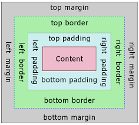

# CSS Note

## 3 Methods For Adding CSS

- Inline CSS:Directly in the html element(NO!)
- Internal CSS: Using style tags within a single document
- External CSS:Linking an external .css file(Best Practice)

## CSS Selectors


## Colors In CSS

- Color Names
- HTML5 Color names
- Hexadecimal
- RGB

```CSS
/* HTML5 Color names */
body{
    color:red;
    background:coral;
}
/* Hexadecimal */
h1{
    color:#00ff00;
}

/* RGB */
p{
    color:rgb(255,255,255);
}
```

## Margin And Padding



- padding: 用border来进行分割的padding属于inside
- margin: 用border来进行分割的话margin属于outside

```css
/* first pattern */
p{
    margin-top:5px;
    margin-bottom:5px;
    margin-right:10px;
    margin-left:10px;
}

/* secode pattern ,the sequence is top,right,bottom,left*/
p{
    margin: 5px 10px 5px 10px;
}

/* third pattern */
p{
    margin:5px 10px;
}
```